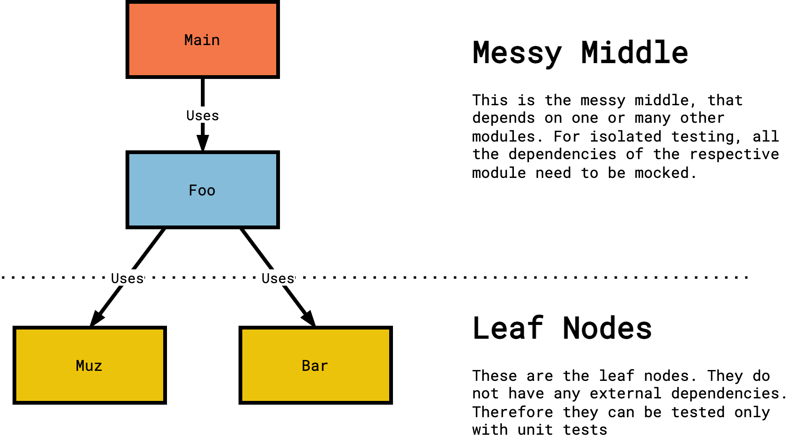

# TDD with C
This project is a short demo on how to incorporate TDD into C projects, without adding complex testing frameworks, nor difficult setup processes.
The process will be explained alongside a short demo scenario.

## Overview of the scenario

As it can be seen in the figure above, the application consists of 4 Modules which are all placed in their respecitve folders in the `App` Folder. These can be split into 2 categories: Leaf Nodes and the Messy middle modules.
- Leaf Nodes: The modules 'Muz' and 'Bar' do some dummy calculations - nothing to really worry about. Yet their functionality was developed with the help of TDD in the unit test folder. Leaf Nodes do not depend on any other modules.
- Messy Middle Nodes: These Nodes do depend on other modules. (This means that this module needs to include another module or header file for proper execution.). 'Foo' simply calls functions from the Muz and Bar and does some data manipulation with the results. This module depends on Muz and Bar. This module was again developed with TDD, yet the dependencies of this module were mocked. Main is even more boring. it only calls `Foo_init()` and then runs `Foo_exec()`. In order to create a mock, you simply need to change the `#include Module.h` in the `test_Module.c` File to `#include mock_Module.h`. Ceedling's parser understands this and generates the mock for you. For further details on mocks, check out their reference (CMock). 

## Prerequesites
Install the Ceedling framework: Just follow the instructions which are listed on the official web page of the framework: http://www.throwtheswitch.org/ceedling

## Run the test suite
Just navigate into the project folder (so on Level above the App and the test folder) and type `ceedling test:all` into the console. Ceedling will now generate all the mock modules, build the test executables and run all the tests, which are specified in the test source files.

## Run them all
Please check out the test folder and in there check out the test files for Muz and Bar.
In order to run all tests enter `ceedling test:all` in the console. This automatically captures all the respective files in the current project, compiles the test binaries and executes the test runners. Besides this - if there are also mocks specified, it will create the mocks (More on that later) and stitches everything together consistently.

You can now see the test report as it is generated

# Sources
I participated in the udemy course of the frameworks' creators which I can highly recommend if you want to learn more. (yep it is exceptionally expensive in relation to other udemy course, but it is fully worth it) You can find the links here:
Course 1: https://www.udemy.com/course/unit-testing-and-other-embedded-software-catalysts/
Course 2: https://www.udemy.com/course/interaction-tests-mocks-and-refactoring-in-embedded-c/

Besides this the official Ceedling Documentation is also a very valuable read.